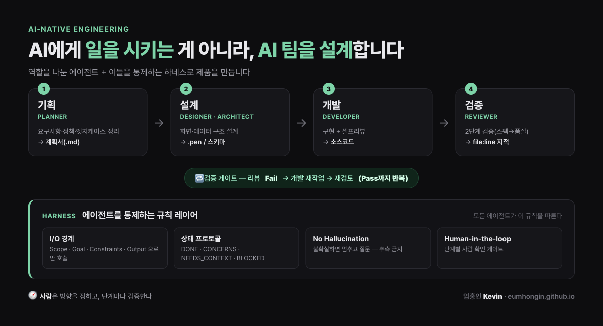

# how-i-use-agents

> By **Kevin (Hongin Eum)** — full-stack engineer, ex-CTO.  →  **[See my portfolio](https://eumhongin.github.io)**

How I actually run AI coding agents on a production product — the work split into
roles (**plan → design → build → review**), bound by a shared **harness**.

Not a framework. Just my setup, generalized and cleaned up so others can borrow it.
I run this solo on a real product; this is the framework-neutral version with the
company-specific parts stripped out. Fork it, fill in your stack, adapt the roles.



## Why not one agent?

Handing an entire task to a single agent gets unstable as the work grows:

- it **guesses** when requirements are unclear,
- it **oversteps** its scope and changes things it shouldn't,
- and it leaves **no trace** of where things went wrong.

Splitting into roles helps. But the real leverage is the **harness** — the shared
rules that constrain every role the same way. The roles do the work; the harness
keeps them honest.

## The roles

| Role          | Does                                              | Does NOT                          |
|---------------|---------------------------------------------------|-----------------------------------|
| **Planner**   | requirements, policies, edge cases → a spec       | design or implementation choices  |
| **Architect** | data model, system design, trade-offs             | API surface / implementation      |
| **Designer**  | screens, design system, UX                        | add scope beyond the spec         |
| **Developer** | implement spec + design, self-review              | change spec intent, refactor wide |
| **Reviewer**  | verify spec → quality, pass/fail with file:line   | modify code directly              |

## The harness (the important part)

Every agent, whatever its role, obeys [`agents/_common.md`](agents/_common.md):

- **Typed I/O** — a call carries only Scope · Goal · Constraints · Output. Roles
  can't reach outside their boundary.
- **Status protocol** — every agent ends with exactly one of
  `DONE` / `DONE_WITH_CONCERNS` / `NEEDS_CONTEXT` / `BLOCKED`, in a fixed format,
  so you always know where it stopped.
- **No guessing** — ambiguity or contradiction means *stop and ask*, not proceed.
  A question beats a wrong guess.
- **Human in the loop** — a person reviews and decides at each gate.

And the **review gate**: the reviewer returns pass/fail; on fail the developer
reworks against `file:line` notes and it loops until it passes. Output isn't "done"
until it clears verification — the line between this and "asking an agent four times."

## It's an early skeleton

This is intentionally minimal. The status protocol and the review gate are the core;
everything else will keep changing. Each role can get much sharper, and the roles
themselves will likely split further over time. Treat it as a starting point I keep
refining, not a finished method.

## Structure

```
agents/
  _common.md     # the harness — every agent obeys this
  planner.md     # turns a request into a spec
  architect.md   # data / system design
  designer.md    # UI / UX design
  developer.md   # implementation + self-review
  reviewer.md    # independent verification gate
docs/
  HARNESS.md     # the harness, explained
```

## Quick start

1. Copy `agents/` into your project (e.g. `.claude/agents/`).
2. Replace every `{{...}}` placeholder with your stack, paths, and conventions.
3. Run the pipeline: **plan → (design) → build → review**, confirming at each gate.
4. Read [`docs/HARNESS.md`](docs/HARNESS.md) for the reasoning behind the rules.

## License

MIT
